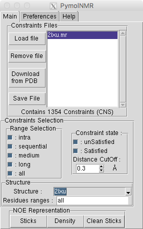
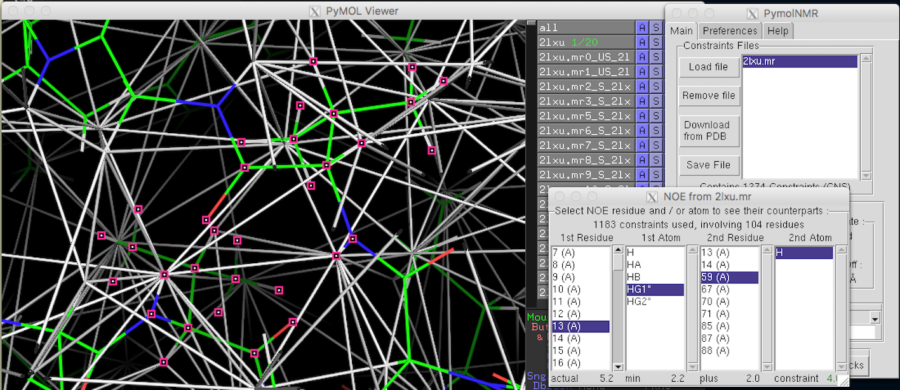

PyNMR
=====
Attempt to add [NMR](http://en.wikipedia.org/wiki/Nuclear_magnetic_resonance) spectroscopy abilities to the wonderful molecular viewer [Pymol](http://pymol.org).

NMR spectroscopy can provide useful information to create molecular models, such as distance between atoms (usually protons / hydrogen atoms in biomolecular biology).
This plugin allows to display distance information (so-called "distance contraints" or [NOEs](https://en.wikipedia.org/wiki/Nuclear_Overhauser_effect)) directly onto the molecular skeleton of proteins. 
It can do so in two different ways :

- As sticks between atoms / group of atoms with color code to indicate if the structure is in agreement with NMR data

- As density with color map on the molecular skeleton

I believe this could help a lot in the tedious process of determining whether the 
constraints extracted from the nmr spectrum make sens or not.

Features :
---
- Import popular data formats [CNS / X-PLOR](http://cns-online.org) or [CYANA / XEASY](http://www.cyana.org)
- Command line and graphical user interfaces available
- Download NMR restraints file from the [PDB](http://www.rcsb.org/pdb/home/home.do) directly from this plugin
- Choose method of distance calculation between atoms (in case of ambiguous restraints)
- Choice for colors and size of NOE representations
- Selection of constraint by clicking and visualization on the 3D structure

Installation :
------------
###For user friendly version :
- Download "PyNMR.py" (Version of 20/11/16)

###For development version :
- Copy all files into a single directory anywhere on your disk

For both versions, use the Pymol standard plugin install in the main menu

Start plugin :
------------

Start PyNMR from the plugin menu.
(For development version, start pymol from the directory where you copy the files)

Usage :
-----
The GUI is quite straightforward for NMR people I think. For CLI, read pymolNMR.py.

The main Interface

The Preference window

The NOE selection window

Possible future features :
------------------------

* Display of angular, dihedral and h-bonds constraints
* Text list of constraints with real-time edit
* Import other formats (CCPNMR, ...)

Any help would be welcome to develop those features. I am definetly not a professional developper, this is done on my spare time and those would require a lot of time and probably competencies I do not have.

Known difficulties :
------------------
* When displaying a large number of constraints as sticks, Pymol performances decrease rapidly (Depends strongly on the performance of your computer):
    * Avoid to draw all constraints if not necessary
    * Remove them before any other action if you can
* Since this is a continuous work in progress, there might be some bugs I am not aware of. I am learning Python while coding this piece of sofware.